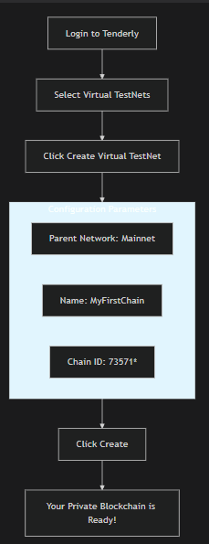
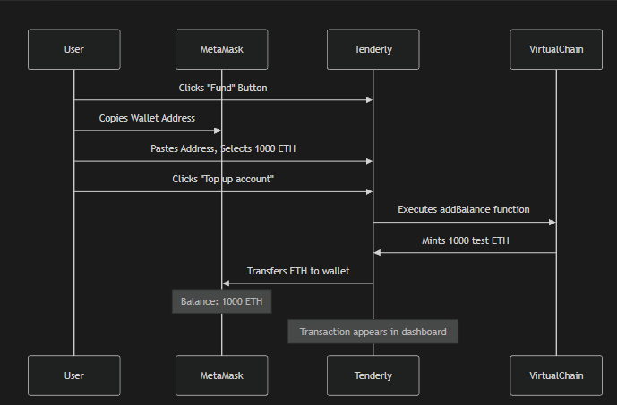
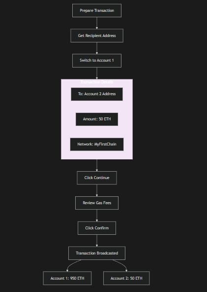

# 🚀 Hands-On Blockchain: Virtual Testnets & Transactions

## 📋 Table of Contents
1. [Introduction to Testnets](#-introduction-to-testnets)
2. [Setting Up Tenderly Virtual Testnet](#-setting-up-tenderly-virtual-testnet)
3. [Your First Blockchain Transaction](#-your-first-blockchain-transaction)
4. [Public vs. Virtual Testnets: A Critical Guide](#-public-vs-virtual-testnets-a-critical-guide)
5. [Tool Demonstration: Public Network Tools](#-tool-demonstration-public-network-tools)

---

## 🧪 Introduction to Testnets

### What is a Testnet?
A **testnet** is a blockchain sandbox environment designed for development, testing, and learning without financial risk. Think of it as a **"practice blockchain"** where you can experiment freely.

### Why Use a Testnet?
- **Zero Financial Risk**: No real money involved
- **Learning Environment**: Perfect for beginners to make mistakes
- **Development Testing**: Test smart contracts before mainnet deployment
- **No Consequences**: Experiment without affecting real networks

### Types of Testnets
```mermaid
graph TD
    A[Testnet Types] --> B[Public Testnets]
    A --> C[Virtual Testnets]
    
    B --> D[Examples: Sepolia, Goerli]
    B --> E[Characteristics]
    E --> F[Decentralized]
    E --> G[Publicly Accessible]
    E --> H[Limited Test Funds]
    
    C --> I[Examples: Tenderly, Hardhat]
    C --> J[Characteristics]
    J --> K[Private/Simulated]
    J --> L[Instant Setup]
    J --> M[Unlimited Test Funds]


    🛠️ Setting Up Tenderly Virtual Testnet
Step 1: Create Your Tenderly Account
Navigate to Course Repository: Visit Cyfrin's Blockchain Basics Repository

Find the Link: Scroll to "Testnet Faucets" section

Use Special Link: Click "Tenderly Virtual Signup" (contains tracking: &mtm_kwd=cyfrin)




Parameter	Value	Why This Matters
Parent Network	Mainnet	Creates exact copy of Ethereum's current state
Name	MyFirstChain (or custom)	Identifies your test environment
Chain ID	73571	CRITICAL: Prevents replay attacks
Note	*73571 = 7357 + 1 (Mainnet ID)*	Custom prefix ensures uniqueness
Step 3: Connect MetaMask
Find Connection Button: Click "Add RPC to Wallet" icon in Tenderly

Approve Connections:

First: Allow Tenderly to connect (Click "Connect")

Second: Add network to MetaMask (Click "Approve")

Verify Connection: Check MetaMask network dropdown

Step 4: Fund Your Wallet

Funding Process:

Copy Wallet Address from MetaMask (Account 1)

Click "Fund" in Tenderly dashboard

Enter Details:

Wallet: Your copied address

Token: Ether (ETH)

Amount: 1000

Verify: Check MetaMask balance updates instantly

💸 Your First Blockchain Transaction
Step 5: Send Wallet-to-Wallet Transaction

# In MetaMask:
1. Click account icon (top-right)
2. Select "Account 2"
3. Click to copy address
# Format: 0x742d35Cc6634C0532925a3b844Bc9e...

initiate transfer
// Transaction Structure Being Created:
{
  from: "0xYourAccount1Address",
  to: "0xAccount2Address",
  value: "50000000000000000000", // 50 ETH in wei
  gasLimit: 21000,
  gasPrice: "30000000000", // 30 Gwei
  chainId: 73571, // Your custom chain ID
  nonce: 0 // First transaction from this account
}

