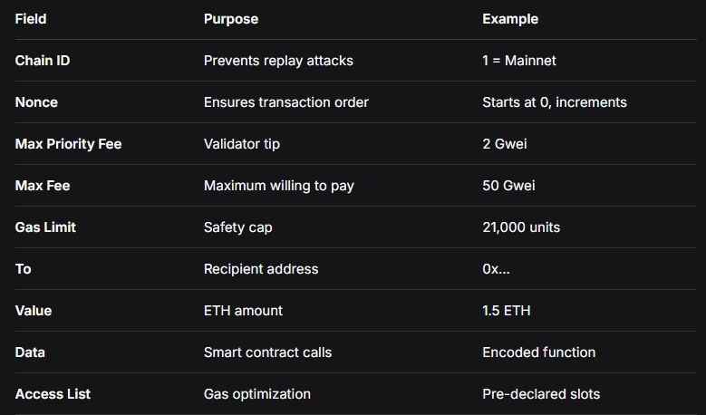

🔄 Ethereum Transactions & Account Evolution
📋 Table of Contents
Transaction Lifecycle

Account Abstraction

EIP-7702: Temporary Delegation

Comparison Matrix

🚦 Transaction Lifecycle
What is a Transaction?
A signed instruction from an account owner that changes Ethereum's state. Every transaction moves the network from one state to another.

The Complete Journey: From Click to Confirmation

🎛️ Account Abstraction
The Two-Account Problem
Ethereum has two incompatible account types:

Externally Owned Accounts (EOAs)
✅ Can initiate transactions
❌ Not programmable
❌ Single private key
❌ No recovery options
🔑 Controlled by private key

## Smart Contract Accounts
✅ Fully programmable
✅ Complex logic possible
✅ Multi-sig support
❌ Cannot initiate transactions
📜 Controlled by code

## The Solution: Smart Wallets
Account Abstraction merges both capabilities into Smart Wallets - programmable smart contracts that can initiate transactions.

## EIP-7702: Temporary Delegation
The Migration Problem
Old Way: To use smart wallet features, users must:

Create new smart wallet address

Transfer all assets

Learn new interface

Update all connected services

Result: High friction prevents adoption of better features.

EIP-7702 Solution
Temporary delegation - EOAs can borrow smart contract powers for single transactions.

